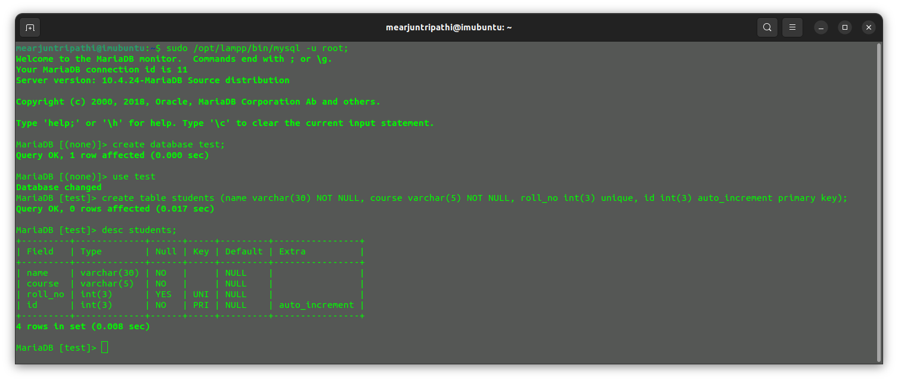

# Building a Robust RESTful API with Node.js and MySQL

In our previous blog post, we explored creating CRUD operations for student data using Node.js, Express.js, and JSON. However, we encountered a major drawback – data was lost when the server closed. Today, we're introducing MySQL, a relational database management system, to store data securely.

Let's dive into the world of databases and create a resilient RESTful API using Node.js, unlocking the full potential of web development.

Certainly, let's add a table of contents to your blog post, along with descriptions for each section.


## Table of Contents

1. [Introduction](#introduction)
2. [Prerequisites](#prerequisites)
3. [Setting Up Your Environment](#setting-up-your-environment)
    - [Initialize Your Project](#initialize-your-project)
    - [Install Dependencies](#install-dependencies)
4. [Creating the API](#creating-the-api)
    - [Database Connection](#database-connection)
    - [Implementing CRUD Operations](#implementing-crud-operations)
5. [API Endpoints](#api-endpoints)
6. [Testing Your API](#testing-your-api)
7. [Conclusion](#conclusion)

## Introduction <a id="introduction"></a>

In this tutorial, we'll walk through the process of creating a RESTful API using Node.js, Express, and MySQL. We'll cover the basic CRUD (Create, Read, Update, Delete) operations, allowing you to interact with a MySQL database.

## Prerequisites <a id="prerequisites"></a>

Before we dive in, make sure you have the following installed on your system:

- Node.js and npm
- MySQL Database
- Postman (for testing API endpoints)

## Setting Up Your Environment <a id="setting-up-your-environment"></a>

### Initialize Your Project <a id="initialize-your-project"></a>

First, let's set up a new Node.js project. Create a new directory for your project and run:

```bash
mkdir node-mysql-rest-api
cd node-mysql-rest-api
npm init -y
```

### Install Dependencies <a id="install-dependencies"></a>

We'll need Express and the MySQL package to build our API. Install them using npm:

```bash
npm i express mysql
```

## Creating the API <a id="creating-the-api"></a>

### Database Connection <a id="database-connection"></a>

In your `app.js` or main file, establish a connection to your MySQL database:

create a table and data base 



```javascript
// Database connection code here
const con = mysql.createConnection({
    host: "localhost",
    password: "",
    user: "root",
    database: "test"
});

con.connect(err => {
    if (err) {
        console.error("Database Commection error:", err);
    } else {
        console.log('Sucessfully database connected');
    }
});
```

### Implementing CRUD Operations <a id="implementing-crud-operations"></a>

Let's create the routes and functions for our API:

- `GET /students` to retrieve all students.
- `GET /students/:id` to retrieve a specific student.
- `POST /students` to add a new student.
- `PUT /students/:id` to update a student's information.
- `PATCH /students/:id` to partially update a student's information.
- `DELETE /students/:id` to delete a student.

```javascript
// Implement your CRUD operations here
async function getAllStudents(req, res) {
    try {
        const query = "SELECT * FROM students";
        const result = await queryPromise(query);
        res.status(200).send(result);
    } catch (error) {
        console.error(error);
        res.status(500).json({ message: "Some issue occured" });
    }
}

async function getAStudent(req, res) {
    try {
        const id = req.params.id;
        const query = "SELECT * FROM students where id = ?";
        const result = await queryPromise(query, id);
        res.status(200).send(result);
    } catch (error) {
        console.error(error);
        res.status(500).json({ message: "Some issue occured" });
    }
}

async function addStudent(req, res) {
    try {
        const value = req.body;
        const query = "INSERT INTO students SET ?";
        // const result = await queryPromise(query, value);

        res.status(201).json({ message: "Data Successfully inserted" });
        console.log(value);
    } catch (error) {
        console.error(error);
        res.status(500).json({ message: "Some issue occurred" });
    }
}

async function updateStudent(req,res){
    try{
        let id = req.params.id;
        req.body.name = req.body.name !== undefined ? req.body.name : "";
        req.body.course = req.body.course !== undefined ? req.body.course : "";
        req.body.roll_no = req.body.roll_no !== undefined ? req.body.roll_no : "";
        const value = req.body;

        const query = "UPDATE students SET ? WHERE id = ?";
        const result = await queryPromise(query,[value, id]);
        res.status(202).json({message: "Data Update Sucessfully"});
        console.log(result);
    }catch(error){
        console.error(error);
        res.status(500).json({ message: "Some issue occurred" });
    }
}

async function updateStudentvalue(req, res){
    try{
        const id = req.params.id;
        const value = req.body;
        const query = "UPDATE students SET ? WHERE id = ?";

        const result = await queryPromise(query, [value, id]);
        res.status(202).json({message: "Data Update Sucessfully"});
        console.log(result);
    }catch(error){
        console.error(error);
        res.status(500).json({message: "Some issue occurred"});
    }
}

async function deleteStudent(req, res){
    try{
        const id = req.params.id;
        const query = "DELETE FROM students where id = ?";

        const result = await queryPromise(query, id);
        res.status(200).json({message: "Data delete sucessfully"});
    }catch(error){
        console.error(error);
        res.status(500).json({message: "Some issue occurred"});
    }
}
```

## API Endpoints <a id="api-endpoints"></a>

Define the API endpoints and set up Express to listen on a specific port:

```javascript
// API endpoint definitions here
app.get("/students/", getAllStudents);

app.get('/students/:id', getAStudent);

app.post('/students', addStudent);

app.put('/students/:id', updateStudent)

app.patch('/students/:id', updateStudentvalue)

app.delete('/students/:id', deleteStudent)

app.listen(port, console.log(`Server started on http://localhost:${port}`));
```

## Testing Your API <a id="testing-your-api"></a>

Use Postman to test your API endpoints. Send GET, POST, PUT, PATCH, and DELETE requests to verify that your API works as expected.

## Conclusion <a id="conclusion"></a>

Congratulations! You've created a RESTful API with Node.js, Express, and MySQL. This tutorial covered the basics, but you can expand on it by adding authentication, input validation, and error handling to make your API production-ready.

Feel free to adapt and extend this code for your specific project needs. Happy coding!