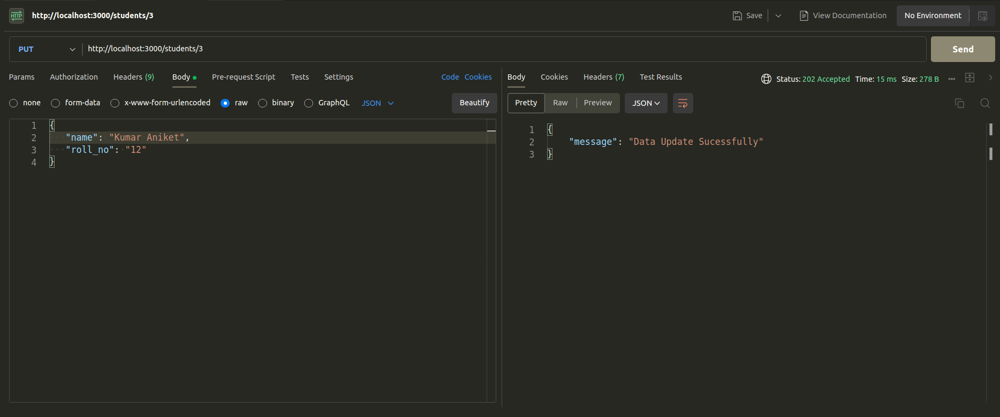
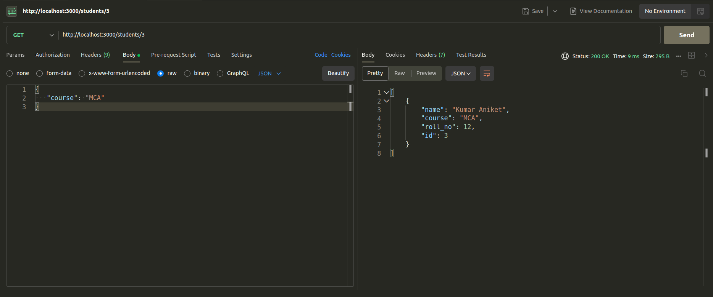

# Building a RESTful API with Node.js and MySQL

In our previous blog post, we explored creating CRUD operations for student data using `Node.js`, `Express.js`, and `JSON`. However, we encountered a major drawback – data was lost when the server closed. Today, we're introducing MySQL, a relational database management system, to store data securely.

Let's dive into the world of databases and create a resilient RESTful API using `Node.js`, unlocking the full potential of web development.

## Table of Contents
1. [Prerequisites](#prerequisites)
2. [Step 1: Initialize the Project](#step-1-initialize-the-project)
3. [Step 2: Set Up the Database](#step-2-set-up-the-database)
4. [Step 3: Create API Endpoints](#step-3-create-api-endpoints)
    - [Get All Students](#get-all-students)
    - [Get a Student by ID](#get-a-student-by-id)
    - [Add a Student](#add-a-student)
    - [Update a Student](#update-a-student)
        - [Full Update](#full-update)
        - [Partial Update](#partial-update)
    -[Delete a Student](#delete-a-student)
5. [Step 4: Start the Server](#step-4-start-the-server)
6. [Step 5: Test Your API](#step-5-test-your-api)
7. [Conclusion](#conclusion)

## Prerequisites

Before you begin, make sure you have the following installed on your system:

- Node.js/Express.js
- MySQL Server (e.g., MariaDB)
- A code editor (e.g., Visual Studio Code)

## Step 1: Initialize the Project

1. Create a new directory for your project.
2. Open a terminal and navigate to the project directory.
3. Run `npm init` to initialize your Node.js project and follow the prompts to create a `package.json` file.
4. Install the necessary packages:

    ```bash
    mkdir crud-MySQL
    cd crud-MySQL
    npm init -y
    npm i express mysql
    ```

5. Create a database and table where data which we store


All done in inilization

## Step 2: Set Up the Database

1. Create a MySQL database named `test`.
2. Inside your project directory, create a JavaScript file (e.g., `app.js`) and require the necessary modules:

```javascript
import express from 'express';
import mysql from 'mysql';
```

3. Create an instance of the Express application and configure it to parse JSON and URL-encoded data:

```javascript
const app = express();
app.use(express.urlencoded({ extended: true }));
app.use(express.json());
```

4. Define the MySQL connection parameters and establish a connection:

```javascript
const con = mysql.createConnection({
    host: "localhost",
    user: "root",
    password: "",
    database: "test"
});

con.connect(err => {
    if (err) {
        console.error("Database Connection Error:", err);
    } else {
        console.log('Successfully connected to the database');
    }
});
```

## Step 3: Create API Endpoints

Now, let's define the API endpoints for your RESTful API.

Here we use query promise which use promise which help to avoide "[pyramid of doom](https://en.wikipedia.org/wiki/Pyramid_of_doom_(programming))"

```javascript
function queryPromise(query, value) {
    return new Promise((resolve, reject) => {
        con.query(query, value, (err, result) => {
            if (err) reject(err);
            else resolve(result);
        })
    })
}
```

### Get All Students
 - Endpoint: `/students`
  - Method: GET
  - Description: Retrieves a list of all student records from database.

```javascript
app.get("/students/", async (req, res) => {
    try {
        const query = "SELECT * FROM students";
        const result = await queryPromise(query);
        res.status(200).send(result);
    } catch (error) {
        console.error(error);
        res.status(500).json({ message: "Some issue occurred" });
    }
});
```

### Get a Student by ID
  - Endpoint: `/students/:id`
  - Method: GET
  - Description: Retrieves a single student record by providing the `id` parameter in db table.

```javascript
app.get('/students/:id', async (req, res) => {
    try {
        const id = req.params.id;
        const query = "SELECT * FROM students WHERE id = ?";
        const result = await queryPromise(query, id);
        res.status(200).send(result);
    } catch (error) {
        console.error(error);
        res.status(500).json({ message: "Some issue occurred" });
    }
});
```

### Add a Student
  - Endpoint: `/students`
  - Method: POST
  - Description: Adds a new student record to the db table.

```javascript
app.post('/students', async (req, res) => {
    try {
        const value = req.body;
        const query = "INSERT INTO students SET ?";
        const result = await queryPromise(query, value);

        res.status(201).json({ message: "Data successfully inserted" });
        console.log(result);
    } catch (error) {
        console.error(error);
        res.status(500).json({ message: "Some issue occurred" });
    }
});
```

### Update a Student

#### Full Update

  - Endpoint: `/students/:id`
  - Method: PUT
  - Description: Updates an existing student from table by providing the `id` parameter.

```javascript
app.put('/students/:id', async (req, res) => {
    try {
        let id = req.params.id;
        const value = req.body;
        const query = "UPDATE students SET ? WHERE id = ?";
        const result = await queryPromise(query, [value, id]);
        res.status(202).json({ message: "Data updated successfully" });
        console.log(result);
    } catch (error) {
        console.error(error);
        res.status(500).json({ message: "Some issue occurred" });
    }
});
```

#### Partial Update

  - Endpoint: `/students/:id`
  - Method: PATCH
  - Description: Partially updates an existing student from table by providing the `id` parameter. You can update one or more fields individually.

```javascript
app.patch('/students/:id', async (req, res) => {
    try {
        const id = req.params.id;
        const value = req.body;
        const query = "UPDATE students SET ? WHERE id = ?";
        const result = await queryPromise(query, [value, id]);
        res.status(202).json({ message: "Data updated successfully" });
        console.log(result);
    } catch (error) {
        console.error(error);
        res.status(500).json({ message: "Some issue occurred" });
    }
});
```

### Delete a Student

  - Endpoint: `/students/:id`
  - Method: DELETE
  - Description: Deletes an existing student from table by providing the `id` parameter.

```javascript
app.delete('/students/:id', async (req, res) => {
    try {
        const id = req.params.id;
        const query = "DELETE FROM students WHERE id = ?";
        const result = await queryPromise(query, id);
        res.status(200).json({ message: "Data deleted successfully" });
    } catch (error) {
        console.error(error);
        res.status(500).json({ message: "Some issue occurred" });
    }
});
```

## Step 4: Start the Server

Finally, start the server and listen on a port (e.g., 3000):

```javascript
const port = process.env.PORT || 3000;
app.listen(port, () => {
    console.log(`Server started on http://localhost:${port}`);
});
```

## Step 5: Test Your API

It's crucial to thoroughly test your RESTful API to ensure that it functions as expected. You can use tools like Postman or cURL to make HTTP requests to the defined endpoints and verify their behavior. Here's how you can test each HTTP request type:

1. **GET Request**

    

    - **Description**: Perform a GET request to retrieve data from your API.
    - **Expected Result**: Since there's no data in the initial state, the response should be empty. Ensure that the API responds with the correct HTTP status code (usually 200 OK for a successful GET request).

2. **POST Request**

     Insert element 1
     Insert element 2
     Insert element 3

    - **Description**: Execute a POST request to add new elements to your database.
    - **Expected Result**: The API should accept the POST request, insert the specified data into the database, and respond with a success message or a unique identifier for the newly created resource. Check that the data has been added to your database.

3. **PUT Request**

    

   To check the update, use a **GET Request with a single user**:

    

    - **Description**: Use a PUT request to update existing data in your database.
    - **Expected Result**: The API should allow updates to the specified resource, and when you subsequently make a GET request for the updated resource, it should return the modified data. Confirm that the resource was successfully updated.

4. **PATCH Request**

    

   For verification, use a **GET Request with a single user**:

    

    - **Description**: Send a PATCH request to partially modify an existing resource.
    - **Expected Result**: The API should apply the specified changes to the resource and respond with a success message. When you subsequently make a GET request for the resource, it should return the modified data. Ensure that the partial update was successful.

5. **DELETE Request**

    

   To retrieve all data, send a **GET Request**:

    

    - **Description**: Issue a DELETE request to remove a resource from the database.
    - **Expected Result**: The API should delete the specified resource and return a success message. When you make a subsequent GET request for all data, the deleted resource should no longer be present.

By conducting these tests, you can ensure that your RESTful API functions correctly and meets the requirements of your application. It's essential to verify that your API handles various HTTP methods and responds appropriately to different requests.

That's it! You've successfully created and tested a RESTful API using MySQL and Node.js. You can further enhance your API by implementing features like authentication, data validation, error handling, and more to meet the specific needs of your project.

## Conclusion
In conclusion, this documentation has outlined the process of creating a RESTful API using MySQL and Node.js. We've covered setting up the environment, establishing a database connection, defining API endpoints, and using query promises to handle asynchronous database queries. This approach enhances code organization and readability, making it easier to manage asynchronous operations in your API. You can further extend this foundation to build more complex and robust applications.