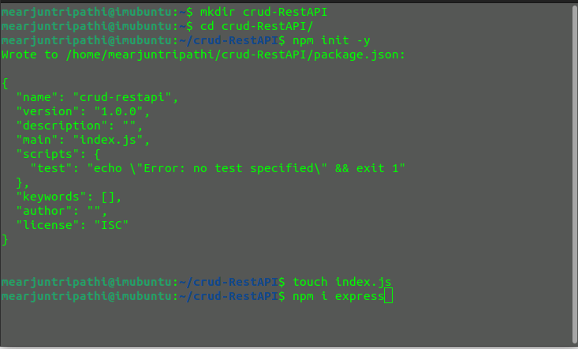
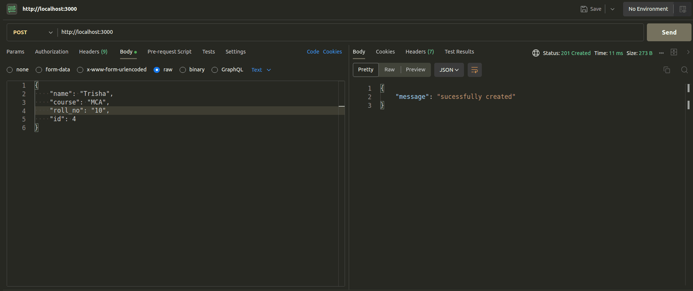

# Readme: Building a Student Data Management RESTful API with Express.js

In this guide, we will walk you through the process of building a RESTful API for managing student data using Node.js and the Express.js framework. This backend code tutorial assumes you have a working knowledge of JavaScript, Node.js, Express.js, and JSON.

## Table of Contents
1. [Introduction](#introduction)
2. [HTTP Methods and Their Meanings](#http-methods-and-their-meanings)
3. [Starting the Server and Receiving Data](#starting-the-server-and-receiving-data)
4. [Steps to Set Up the API](#steps-to-set-up-the-api)
5. [Explanation of the Code](#explanation-of-the-code)
6. [API Endpoints](#api-endpoints)
7. [Testing the API](#testing-the-api)
8. [Conclusion](#conclusion)

## Introduction
In this tutorial, we'll create a Student Data Management RESTful API that enables various operations on student records. With this API, you can retrieve a list of all student data, access specific student details, insert new student records, update existing student information, and delete student records. It's a comprehensive solution for efficiently managing student data in your application.

## HTTP Methods and Their Meanings
HTTP methods, or verbs, define the type of action to perform on a resource identified by a URL. Here are the HTTP methods used in this API:

- **GET:** Retrieve data from a specified resource.
- **POST:** Submit data to be processed to a specified resource.
- **PUT:** Update a resource or create a new one if it doesn't exist at a specified URL.
- **PATCH:** Apply partial modifications to a resource.
- **DELETE:** Request the removal of a resource at a specified URL.

These HTTP methods provide a standardized way for clients to interact with web servers and perform various operations on resources, which is essential in a RESTful architecture.

## Steps to Set Up the API
Follow these steps to set up the Student Data Management RESTful API using Express.js:

1. **Create a folder:**
   ```
   mkdir crud-RestAPI
   ```

2. **Initialize npm:**
   ```
   npm init -y
   ```

3. **Create a JavaScript file:**
   ```
   touch index.js
   ```

4. **Install Express.js:**
   ```
   npm i express
   ```

   

## Explanation of the Code
The code in `index.js` does the following:

- Sets up an Express.js server and initializes an in-memory data store for student records.
- Configures middleware to handle URL-encoded and JSON data in incoming requests.

Please note that the code uses `ESM` (EcmaScript Module) syntax for importing the Express.js module. There's also a commented line showing how to use Common JS (`CJS`) syntax.

## Starting the Server and Receiving Data

In your Express.js code, you start the server and receive data using specific code segments. Here's how it's done:

### Starting the Server

In your JavaScript file (e.g., `index.js`), you start the server by listening on a specific port. If the `process.env.port` environment variable is not defined, the server will default to port 3000. Here's the relevant code:

```javascript
const port = process.env.port || 3000;

app.listen(port, () => {
    console.log(`Server is running at: http://localhost:${port}`);
});
```

This code sets up the server and starts it. You'll see a message in the console indicating that the server is running at a specific URL, typically `http://localhost:3000`.

### Receiving Data with Middleware

In your Express application, you use middleware to handle incoming requests. Two important middleware functions are configured to handle URL-encoded and JSON data in incoming requests. Here's how this is set up:

```javascript
app.use(express.urlencoded({ extended: true }));
app.use(express.json());
```

- `express.urlencoded({ extended: true })` is middleware that parses incoming requests with URL-encoded payloads. This is commonly used to parse data sent by HTML forms.

- `express.json()` is middleware that parses incoming requests with JSON payloads. It allows your application to handle JSON data sent in the request body.

These middleware configurations ensure that your API can properly receive and process data sent in various formats.

Now, with these additions, you have the complete process of starting the server and receiving data in your Express.js application, making it easier for users to understand how your API works.

## API Endpoints
The API provides the following endpoints:

## Storing and Rendering JSON Data

In your Express.js code, you store and render JSON data using the `data` variable. Here's how this part of the code works:

```javascript
let data = [
    { "name": "Arjun Tripathi", "course": "MCA", "roll_no": "14", "id": 1 },
    { "name": "Rahul Durgapal", "course": "MCA", "roll_no": "36", "id": 2 },
    { "name": "Aniket Yadav", "course": "MCA", "roll_no": "08", "id": 3 }
];
```

In the above code, an array named `data` is initialized. This array acts as an in-memory database where you can store and manipulate student data without using an external database. You can modify this array to include additional student records.

When you define your API endpoints and handle incoming requests, you often interact with this `data` variable to read or modify student records. For example, when you retrieve data, you send the contents of this array as a JSON response:


By using the `data` variable, you can effectively manage student data within your Express.js application without the need for an external database. This in-memory database simplifies the development process and helps you learn and experiment with building APIs.

- **Get All Student Data (Read)**
  - Endpoint: `/`
  - Method: GET
  - Description: Retrieves a list of all student records.
 
    ```javascript
    // Endpoint: /
    // Method: GET
    // Description: Retrieves a list of all student records
    app.get('/', function (req, res) {
        res.status(200).json(data);
    });
    ```

- **Get a Single Student Record (Read)**
  - Endpoint: `/:id`
  - Method: GET
  - Description: Retrieves a single student record by providing the `id` parameter.

    ```javascript
    // Endpoint: /:id
    // Method: GET
    // Description: Retrieves a single student record by providing the `id` parameter
    app.get("/:id", function (req, res) {
        let found = data.find(function (item) {
            return item.id === parseInt(req.params.id);
        });
        if (found) {
            res.status(200).json(found);
        } else {
            res.sendStatus(404);
        }
    });
    ```

- **Insert a New Student Record (Create)**
  - Endpoint: `/`
  - Method: POST
  - Description: Adds a new student record to the collection.

    ```javascript
    // Endpoint: /
    // Method: POST
    // Description: Adds a new student record to the collection
    app.post('/', function (req, res) {
        let items = data.map(item => item.id);
        let newId = items.length > 0 ? Math.max.apply(Math, items) + 1 : 1;
        let newItem = {
            id: newId,
            name: req.body.name,
            course: req.body.course,
            roll_no: req.body.roll_no
        };
        data.push(newItem);
        res.status(201).json({ 'message': "successfully created" });
    });
    ```

- **Update a Student Record (Update)**
  - Endpoint: `/:id`
  - Method: PUT
  - Description: Updates an existing student record by providing the `id` parameter.

    ```javascript
    // Endpoint: /:id
    // Method: PUT
    // Description: Updates an existing student record by providing the `id` parameter
    app.put('/:id', function (req, res) {
        let found = data.find(function (item) {
            return item.id === parseInt(req.params.id);
        });
        if (found) {
            let updateData = {
                id: found.id,
                name: req.body.name,
                course: req.body.course,
                roll_no: req.body.roll_no
            };
            let targetIndex = data.indexOf(found);
            data.splice(targetIndex, 1, updateData);
            res.status(201).json({ 'message': "data updated" });
        } else {
            res.status(404).json({
                'message': 'unable to insert data because data inserted not matched'
            });
        }
    });
    ```

- **Partially Update a Student Record (Update)**
  - Endpoint: `/:id`
  - Method: PATCH
  - Description: Partially updates an existing student record by providing the `id` parameter. You can update one or more fields individually.

    ```javascript
    // Endpoint: /:id
    // Method: PATCH
    // Description: Partially updates an existing student record by providing the `id` parameter. You can update one or more fields individually.
    app.patch("/:id", function (req, res) {
        let found = data.find(function (item) {
            return item.id === parseInt(req.params.id);
        });
        if (found) {
            if (req.body.name) {
                found.name = req.body.name;
            }
            if (req.body.course) {
                found.course = req.body.course;
            }
            if (req.body.roll_no) {
                found.roll_no = req.body.roll_no;
            }
            res.status(201).json({ "message": "data updated" });
        } else {
            res.status(404).json({
                'message': 'unable to insert data because data inserted not matched'
            });
        }
    });
    ```

- **Delete a Student Record**
  - Endpoint: `/:id`
  - Method: DELETE
  - Description: Deletes an existing student record by providing the `id` parameter.

    ```javascript
    // Endpoint: /:id
    // Method: DELETE
    // Description: Deletes an existing student record by providing the `id` parameter
    app.delete('/:id', function (req, res) {
        let found = data.find(function (item) {
            return item.id === parseInt(req.params.id);
        });
        if (found) {
            let targetIndex = data.indexOf(found);
            data.splice(targetIndex, 1);
            res.sendStatus(204);
        } else {
            res.sendStatus(404);
        }
    });
    ```

For each endpoint, the documentation provides information about the HTTP method, the endpoint URL, and the expected request and response formats.

## Testing the API
To test the API endpoints you've defined in your code, you can use tools like Postman or ThunderClient (an extension for Visual Studio Code). 


### Testing the API with Postman

To test the API endpoints, we recommend using a tool like Postman. However, you can use any API testing tool of your choice. Here, we'll demonstrate how to use Postman to interact with your API.

1. **GET Request**

    

2. **POST Request**

    

3. **PUT Request**

    

   To check the update, use a **GET Request with a single user**:

    

4. **PATCH Request**

    

   For verification, use a **GET Request with a single user**:

    

5. **DELETE Request**

    

   To retrieve all data, send a **GET Request**:

    

In these screenshots, you can observe the interactions with your API. In the GET request, you see all elements. In the POST request, you insert one element. In the PUT request, you update it, but it overwrites the existing data. To demonstrate an update without overwriting, you use a PATCH request. Finally, you delete the inserted data using a DELETE request.

Feel free to use these examples and adjust them to your specific API testing needs. Postman is a powerful tool for API development and testing, making it easier to validate your API's functionality and behavior.


## Conclusion
This API offers basic functionality for managing student data, allowing you to create, retrieve, update, and delete student records in JSON format. For further enhancements, consider adding authentication and validation for robust security and data integrity.