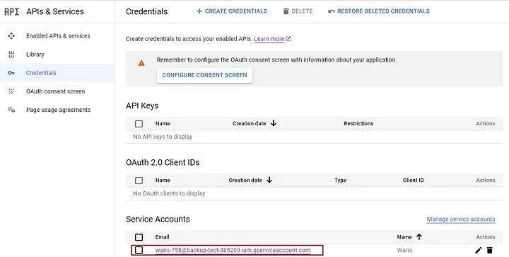

**Using Google Drive with Node.js**

In situations where storage limitations become a concern, exploring alternative solutions becomes essential. Suppose you're utilizing platforms like GitHub or Versal for hosting frontend applications, which offer restricted storage space, typically around 2GB. In such scenarios, leveraging Google Drive for storing files can be a viable option.

By integrating Google Drive with your Node.js applications, you can harness the robust storage capabilities of Google Cloud. This documentation aims to provide a concise guide on utilizing Google Drive in conjunction with Node.js to manage files efficiently.

**Prerequisites**

Before embarking on the integration process, ensure you have the following prerequisites in place:

1. A Google account with access to the Google Cloud Console.
2. Node.js installed on your local machine.
3. NPM (Node Package Manager) installed.


**Step 1: Set Up Google Cloud Console and Enable Google Drive API**

1. Go to the Google Cloud Console.
2. Create a new project.
3. Navigate to "APIs & Services" > "Library".
4. Search for "Google Drive API" and enable it.


**Step 2: Obtain Service Account Credentials**

1. Navigate to "APIs & Services" > "Credentials".
2. Create a new Service Account.
3. Download the JSON file with the credentials.





**Step 3: Install Necessary Packages**

Install the required packages using NPM. This includes the 'googleapis' package, which facilitates interaction with Google APIs.

```bash
npm install googleapis
```

**Step 4: Implement File Management Functions**

Utilize the provided code snippets to implement various file management functionalities, including:

- Listing available files in Google Drive.
- Uploading files to Google Drive.
- Updating existing files in Google Drive.
- Deleting files from Google Drive.

for that you should use folder_id and make it public and editable


**Step 5: Run the Application**

Execute the Node.js application to perform file management operations on Google Drive. Ensure to replace placeholders such as 'FOLDER_ID_HERE' with relevant IDs and file paths.

By following these steps, you can seamlessly integrate Google Drive into your Node.js applications, leveraging its robust storage infrastructure for handling files efficiently. 